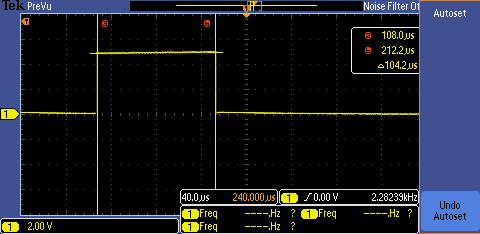
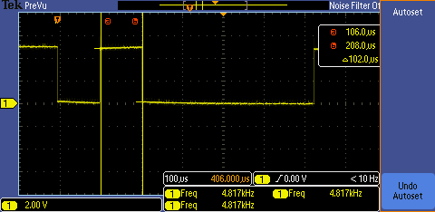
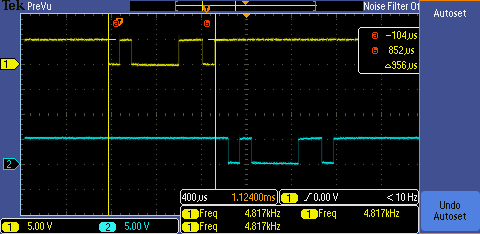
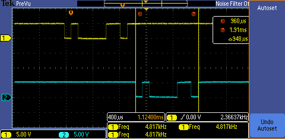
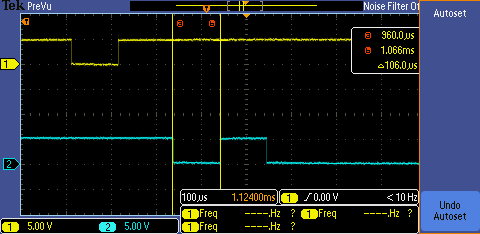
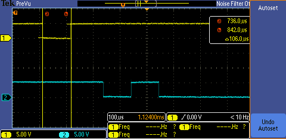
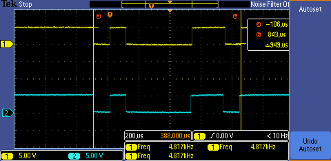
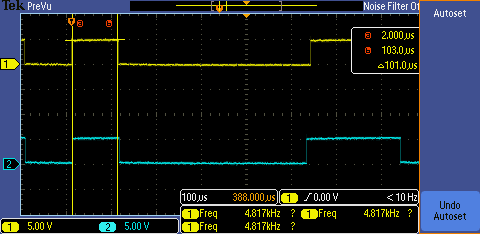

# ArduinoCode (SP UART 실험)

Arduino Uno에서 UART 통신을 **비트뱅(Software UART)** 과 **하드웨어 UART**로 구현/비교하고, 오실로스코프로 파형을 관찰한 뒤 실험 결과를 CSV로 정리해 간단한 분석(및 예측)까지 진행한 프로젝트입니다.

## 구성

- `01/01_code/01_code.ino`: SP/01 임의 문자(`'a'`) 전송 파형 관찰 (D8)
- `02/02_code/02_code.ino`: SP/02 `PORTB` 직접 제어(Bit-bang)로 전송 (D8)
- `03/03_code/03_code.ino`: SP/03 2채널 동시 관찰 (D8 vs D1)
- `04/04_code/04_code.ino`: SP/04 루프백 검증 (D8 → D0, 수신을 시리얼로 출력)
- `05/05_code/05_code.ino`: SP/05 다양한 문자 반복 검증 (D8 → D0 루프백)
- `06/06_code/06_code.ino`: SP/06 보레이트 단계 상승(Software UART) 성공률 측정
- `07/07_code/07_code.ino`: SP/07 고속 한계점 탐색(Hardware UART) 성공률 측정
- `08/uart_experiment_data.csv`: SP/06~07 결과 정리 데이터
- `08/SP08_UART_Deep_Learning_Analysis.py`: SP/08 데이터 분석/예측(Colab 기준 스크립트)
- `images/`: 오실로스코프 캡처 이미지(TEK 시리즈)

## 실험 환경

- Board: Arduino Uno
- Scope: Tektronix MSO2012B(또는 유사) / 프로브 10X 권장
- 주요 핀
  - Software TX: `D8`
  - Hardware UART: `D0(RX)`, `D1(TX)`

## 배선/측정 가이드(요약)

- 단일 채널 파형 관찰(SP/01~02): CH1 → `D8`, GND → `GND`
- 2채널 비교(SP/03): CH1 → `D8`, CH2 → `D1`
- 루프백 실험(SP/04~07): 점퍼로 `D8 → D0`, (SP/07은 `D1 → D0`)

자세한 실험 항목은 `docs/test.txt` 참고.

## 결과 요약 (CSV 기준)

`08/uart_experiment_data.csv`에 기록된 결과(각 보레이트당 15회 테스트):

### Software UART (SP/06)

| Baud Rate (bps) | Bit Width (µs) | Success Rate |
|---:|---:|---:|
| 1200 | 833.33 | 100% |
| 2400 | 416.67 | 100% |
| 4800 | 208.33 | 100% |
| 9600 | 104.17 | 100% |
| 19200 | 52.08 | 100% |
| 38400 | 26.04 | 80% |
| 57600 | 17.36 | 0% |
| 115200 | 8.68 | 0% |

### Hardware UART (SP/07)

| Baud Rate (bps) | Bit Width (µs) | Success Rate |
|---:|---:|---:|
| 230400 | 4.34 | 100% |
| 460800 | 2.17 | 100% |
| 921600 | 1.09 | 100% |
| 1000000 | 1.00 | 100% |
| 2000000 | 0.50 | 100% |

## 오실로스코프 캡처

### 단일 채널 (D8, Software TX)

| | |
|---|---|
|  |  |
|  |  |

### 2채널 비교 / 루프백 파형

| | |
|---|---|
|  |  |
|  |  |
|  |  |
|  | |

## 실행 방법

1. Arduino IDE에서 각 실험 폴더의 `.ino`를 열어 업로드합니다.
2. SP/04~07은 점퍼 배선을 먼저 연결합니다.
3. 대부분의 스케치는 결과 출력을 위해 `Serial`(USB 시리얼)을 사용합니다. 스케치 안내문에 맞춰 Serial Monitor의 보레이트를 설정합니다(주로 9600).

## 데이터 분석 (SP/08)

- `08/SP08_UART_Deep_Learning_Analysis.py`는 Colab 실행을 전제로 작성되어 있으며 `08/uart_experiment_data.csv`를 입력으로 사용합니다.
- 필요 라이브러리: `pandas`, `numpy`, `matplotlib`, `seaborn`, `scikit-learn`, `tensorflow`.
